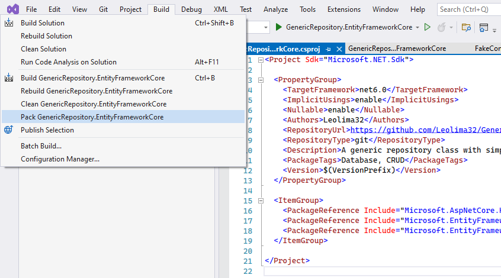
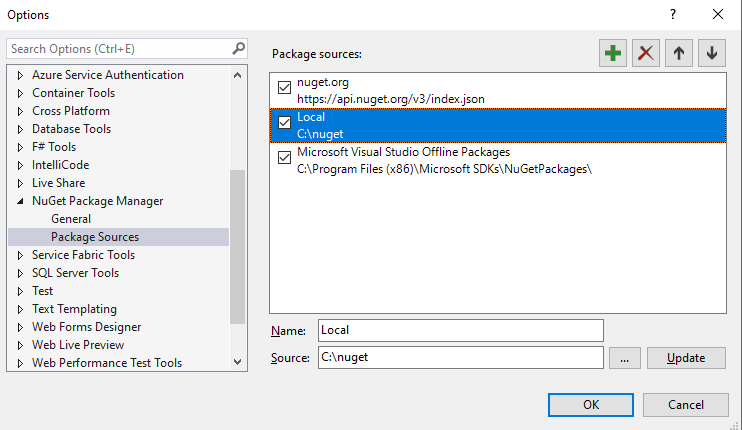
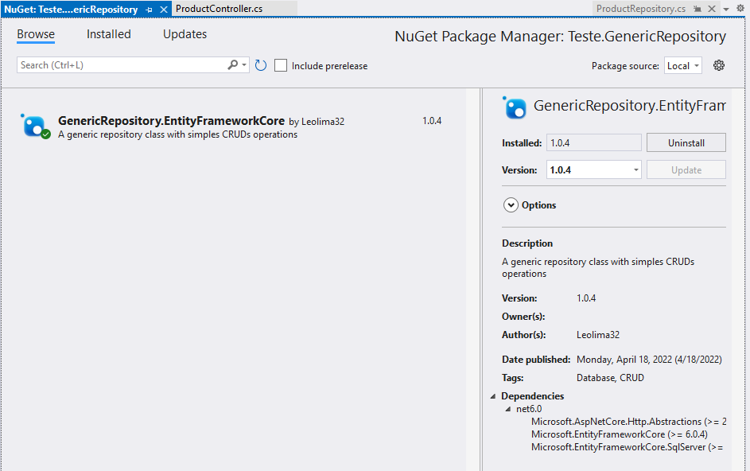

# Generic Repository Package For Entity Framework Core

> Application meant to be used as a nuget package to abstract simple CRUD operations

## 💻 Requirements

Before we begin, check that you have met the following requirements:
* You have installed the latest version of `.NET`.
* You have a running local instance of `SQL SERVER`.


## 🚀 Installation

In order to install this package you can follow this steps:

Visual Studio:

* Open the solution and select GenericRepository.EntityFrameworkCore project, then click on build menu and select Pack GenericRepository.EntityFrameworkCore

* Copy the nupkg file created to a local folder and add that folder as a package source

* Browse your local folder on nuget manager and select this package to install 



## ☕ Using in your project

In order to configure in your project follow this steps

Create your model objects and make them herd from BaseModel class
```
  public class Product : BaseModel
  {
      public string Name { get; set; }
      public double Price { get; set; }
  }
```
Create an context class like this
```
  public class Context : GenericDbContext
  {
      public Context(DbContextOptions options)
      : base(options) 
      {
      }
      public DbSet<Product> Products { get; set; }
  }
```
Create your repository like this
```
  public class ProductRepository : GenericRepository<Product>
  {
      private Context _db;
      public ProductRepository(Context db) : base(db)
      {
          _db = db;
      }
  }
```

Add your database configuration in Program.cs 
```
  builder.Services.AddGenericRepositorySqlServer<Context>("YOUR_CONNECTION_STRING");
```

Thats it! Your repository should have all the functions needed for a basic CRUD operation.
